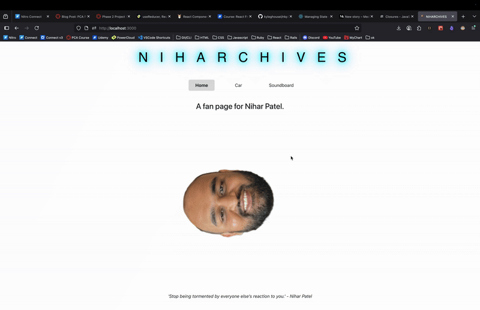

# Enter the Niharchives

## Project Goal
The goal of this project was to create a React App celebrating our beloved classmate Nihar. Included in the app is a home page featuring some beautiful artwork and inspirational quotes Nihar has uttered casually, a soundboard of which Nihar provided his own voicework for all of his most commonly used Gen Z phrases / Niharisms, and a page dedicated to the admiration of his prized Mustang. The goals of the project were to:
  -  Build a React single page application from scratch
  -  Apply knowledge of components, props and state management
  -  Incorporate client-side routing
  -  Use data from an API

## Run Instructions
This project is hosted on Render. Use this [link](https://nkp52.onrender.com/) to access the frontend. The backend has a ~50 second cold start, so it may take a minute for the data to populate.
[Here is the link](https://nkp52-backend.onrender.com/) for the backend, should it take an obnoxious time to start.

